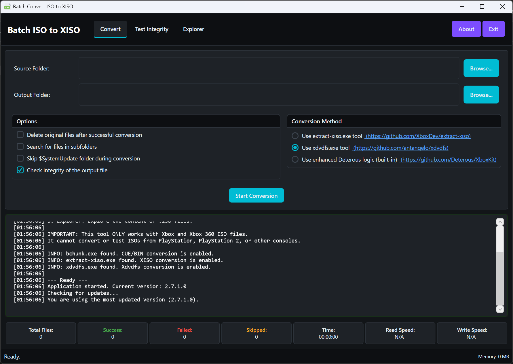
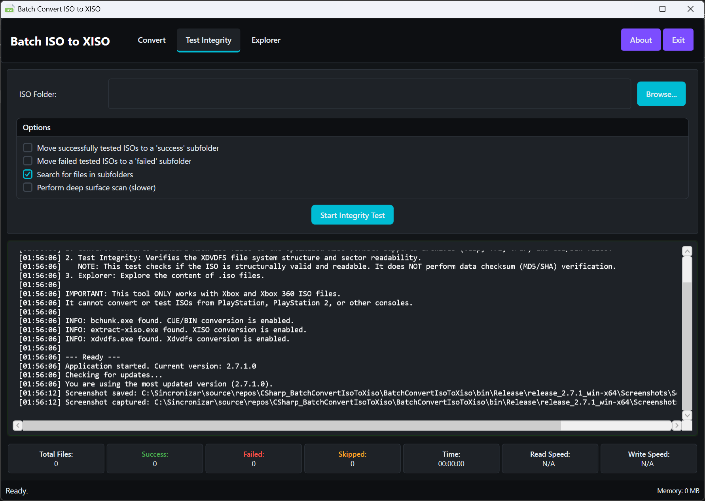
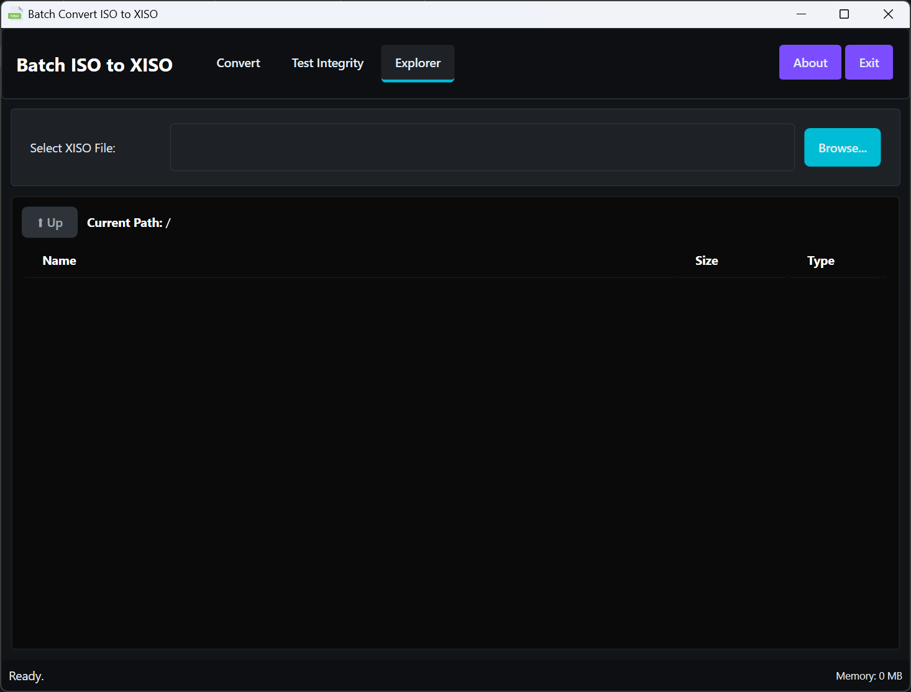

# Batch ISO to XISO Converter — Documentation

| Getting Started | Using the App | Technical Reference | Project |
|---|---|---|---|
| **Home** | [Usage Guide](Usage-Guide.md) | [Architecture](Architecture.md) | [Repository](Repository.md) |
| [Installation](Installation.md) | [Conversion Methods](Conversion-Methods.md) | [XDVDFS Technical Docs](XDVDFS-Technical-Documentation.md) | [Building from Source](Building-from-Source.md) |
| | [XISO Explorer](XISO-Explorer.md) | [Troubleshooting & FAQ](Troubleshooting-and-FAQ.md) | |

---

Welcome to the official documentation for **Batch ISO to XISO Converter** — a high-performance Windows WPF utility built for the Xbox preservation and emulation community. Convert, verify, and explore Xbox and Xbox 360 ISO files with dual-engine support: a native C# XDVDFS engine and external tool integration.

- **Repository:** <https://github.com/purelogiccode/BatchConvertIsoToXiso>
- **Website:** <https://www.purelogiccode.com>
- **License:** GNU General Public License v3.0
- **Current version:** 2.7.2
- **Platform:** Windows x64 / ARM64, .NET 10.0 Desktop Runtime

---

## What This Tool Does

**Batch ISO to XISO Converter** streamlines the process of converting standard Xbox and Xbox 360 disc images (Redump ISOs) into the optimized, trimmed **XISO** format used by original Xbox consoles, emulators, and FTP transfer tools.

The application combines:

1. A **native C# XDVDFS engine** (built-in trim logic) that identifies and copies only the meaningful sectors of a disc image while preserving the original filesystem layout.
2. **External tool integration** with the well-known `extract-xiso` and `xdvdfs` repacking utilities for maximum size reduction.
3. An **integrity tester** that deeply validates the XDVDFS filesystem structure, with an optional surface scan for physical media errors.
4. A built-in **XISO Explorer** that browses the contents of an Xbox ISO without extracting it.

Whether you are managing a large collection of game backups, preparing files for an Xbox hard drive, or verifying the integrity of your dumps, the application provides a user-friendly interface with powerful batch processing capabilities.

---

## Feature Highlights

| Area | Capabilities |
|---|---|
| **Batch Conversion** | Three selectable conversion engines, archive input (`.zip`, `.7z`, `.rar`), CUE/BIN support via `bchunk`, optional `$SystemUpdate` removal, replace-originals mode, post-conversion verification |
| **Integrity Testing** | Structural XDVDFS validation, optional deep surface scan, automatic move of passed/failed files into organized subfolders |
| **XISO Explorer** | Native in-ISO browsing, file metadata, double-click to open, drag-and-drop extraction |
| **Monitoring** | Real-time success/fail/skip counters, per-drive read/write speed indicators, elapsed-time tracking, memory usage |
| **Reliability** | Atomic replace-originals workflow, automatic temp-folder cleanup, fallback temp drives, network path (UNC) support with retry logic, cloud-aware (OneDrive) retries, encrypted-archive detection |
| **Support** | In-app bug reporting and automatic update checks |

---

## Screenshots

| | |
|---|---|
|  |  |
| *Batch conversion with real-time monitoring* | *Integrity testing with batch organization* |
|  | |
| *XISO file browser* | |

---

## Documentation Map

| Page | Contents |
|---|---|
| [Installation](Installation.md) | System requirements, download, first run, upgrading |
| [Usage Guide](Usage-Guide.md) | Complete walkthrough of every tab, option, and indicator |
| [Conversion Methods](Conversion-Methods.md) | Deep comparison of the three conversion engines |
| [XISO Explorer](XISO-Explorer.md) | Browsing, opening, and extracting files from inside an ISO |
| [Troubleshooting & FAQ](Troubleshooting-and-FAQ.md) | Common errors, known issues, frequently asked questions |
| [Architecture](Architecture.md) | Codebase design, services, dependency injection, data flow |
| [XDVDFS Technical Docs](XDVDFS-Technical-Documentation.md) | Binary format internals and the native trimming algorithm |
| [Building from Source](Building-from-Source.md) | Prerequisites, build, and test instructions |
| [Repository](Repository.md) | Repository layout, releases, contributing, and license |

---

## Quick Start

1. **Download** the latest release from the [Releases](https://github.com/purelogiccode/BatchConvertIsoToXiso/releases) page and extract the ZIP — the application is fully portable, no installer required.
2. **Launch** `BatchConvertIsoToXiso.exe` (requires the [.NET 10.0 Desktop Runtime](https://dotnet.microsoft.com/download/dotnet/10.0)).
3. On the **Convert** tab, select an **input folder** containing your ISO files and an **output folder** for the converted XISOs.
4. Pick a **conversion method** (the built-in logic is the safest; `xdvdfs`/`extract-xiso` give the smallest output — see [Conversion Methods](Conversion-Methods.md)).
5. Click **Start Conversion** and monitor progress in real time.

---

## Acknowledgements

- **[extract-xiso](https://github.com/XboxDev/extract-xiso)** — external XISO conversion tool by the XboxDev team
- **[xdvdfs](https://github.com/antangelo/xdvdfs)** — modern Rust XDVDFS tool by antangelo
- **[XboxKit by Deterous](https://github.com/Deterous/XboxKit)** — original XDVDFS trimming logic on which the native engine is based and significantly enhanced
- **[bchunk](https://github.com/extramaster/bchunk)** — CUE/BIN to ISO conversion
- **[SharpCompress](https://github.com/adamhathcock/sharpcompress)** — high-performance archive extraction

---

*If you find this tool useful, please give the repository a star on GitHub!*
